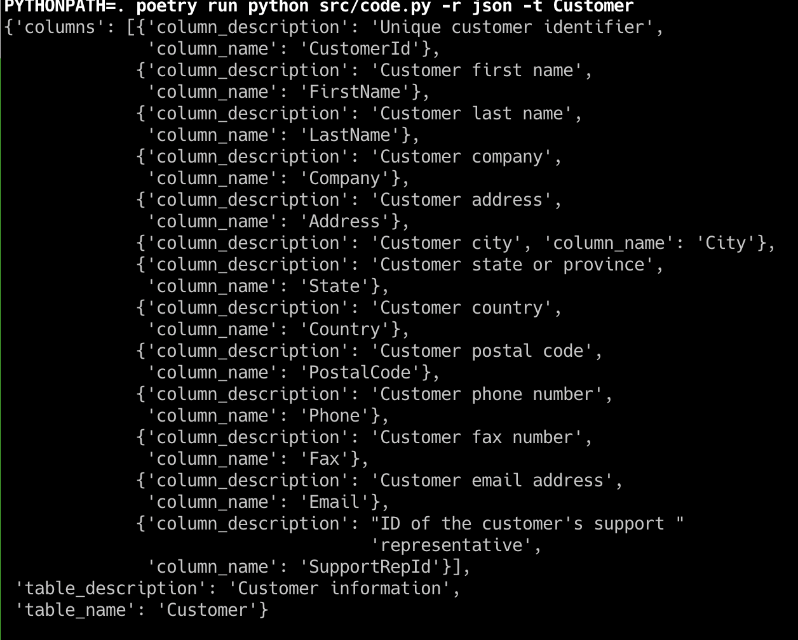
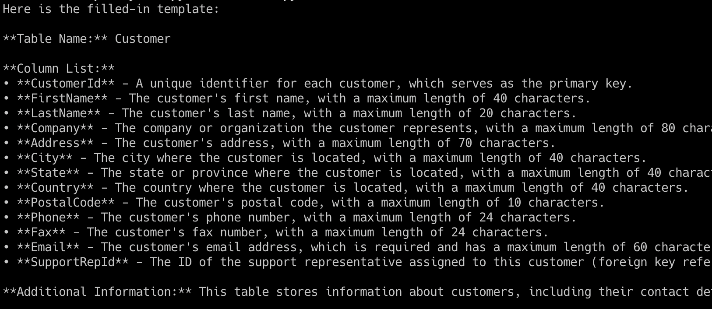

# Description

Example of using an llm along with langchain's SQLDatabase to
create a draft of a table description.

The text response can be used as a basis for building out data dictionary which
will help users of the database.

## Set Up

#### Chinook Database set up

The database used in the code is set up in a sqlite database.  The instructions on
how to set it up locally can be found at [this url](https://database.guide/2-sample-databases-sqlite/).

Also the sql script referenced in the instructions can be found under the `support` dir
with the name `chinook_sqlite.sql`.

#### Justfile + poetry

There is a `.justfile` with common commands.  You can set up `just` on a mac with brew: `brew install just`.
For further reference: [just github](https://github.com/casey/just).

You should run `poetry install` as part of the set up to create the python virtualenv.  There is
a just recipe in the `.justfile` called `install` for this command.

#### Llama3

The code uses `llama3` as the model.  Instructions for local set up is at:
[download ollama](https://ollama.com/download).

You can then run the model in a terminal tab with `ollama serve llama3`.
There are other commands that are helpful in the `.justfile`.

## Running the code

You can run the `run-help` recipe in the `.justfile` to see the help from the command line.

There are two outputs that you can receive.   One is a text output with is a more descriptive
response about a table in the database.  The other is json output which would be useful
for an application that then makes use of the json (serialized as a dict in the python code).

## Output Examples

**JSON Response**

**Text Response**

